# JARKOM MODUL 1 2026 - K-03

## Member

| Nama                      | NRP        |
| ------------------------- | ---------- |
| Yovi Prayudya Rizky Ramadhani      | 5027251129 |
| Dafa Ridho Zhafif  | 5027251129 |

## Laporan

1. Untuk mempersiapkan pembangunan The Wired, Lain yang berperan sebagai Router membuat tiga Switch/Gateway: Switch 1 menuju dua Entitas yaitu Alice dan Mika, Switch 2 menuju Chisa, sedangkan Switch 3 menuju Knights dan Eiri. Kelima Entitas tersebut dikonfigurasi sebagai Client di GNS3. [GUNAKAN PREFIX IP MASING-MASING KELOMPOK]

Untuk mempersiapkan entitas, beberapa komponen yang dibutuhkan adalah 1 router (Lain), 3 switch dengan masing-masing switch: switch 1 - Alice dan Mika, switch 2 - Chisa, switch 3 - Knights dan Eiri. Dan untuk prefix IP kelompok saya (yaitu kelompok 3) adalah 10.65.x.x sesuai pada [spreadsheet](https://docs.google.com/spreadsheets/d/14ZBfO7AgmkQgDGQkTbGF7g_w6z106lSZ/edit?gid=451046761#gid=451046761) yang sudah diberikan. Untuk gambarnya sendiri adalah

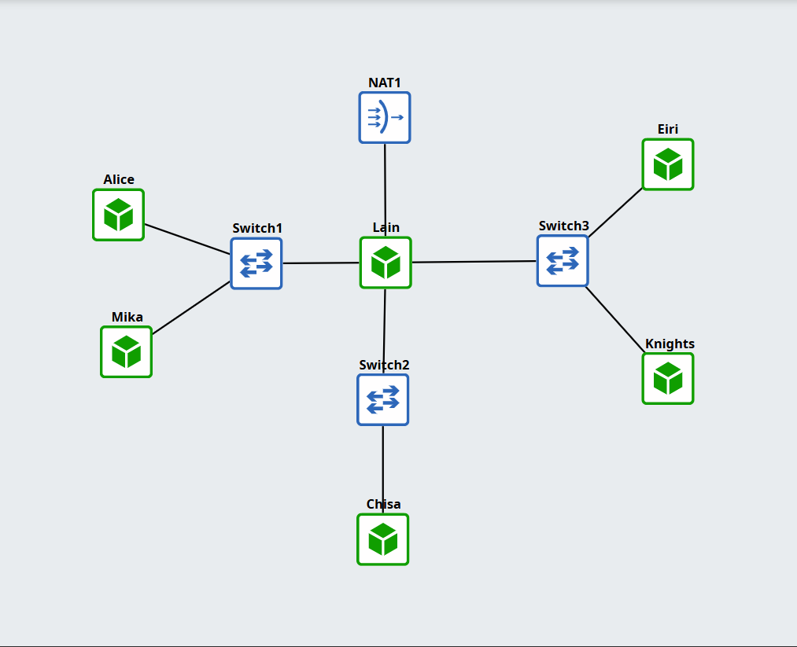

2. Karena menurut Lain pada saat itu The Wired masih terisolasi dari dunia luar, konfigurasikan router Lain agar dapat tersambung langsung ke jaringan internet publik melalui NAT/DHCP pada interface eth0.

Selanjutnya adalah menghubungkan router (Lain) agar bisa diconnect ke luar saya mengacu pada modul yang sudah diberikan yaitu [modul-1](https://github.com/lab-kcks/modul-komdat-jarkom-2026/tree/main/Modul%201#272-konfigurasi-router-linux-multi-homed) dan juga github guide yaitu [assistent mas ardi putra github](https://github.com/ardhptr21/Jarkom-Modul-1-2025-K55/tree/main) pada laporannya bahwa untuk menghubungkan ke luar membutuhkan konfigurasi berupa dhcp yaitu:

```
auto eth0
iface eth0 inet dhcp
```

lalu juga perlu penambahan yaitu 

```
up sysctl -w net.ipv4.ip_forward=1
up iptables -t nat -A POSTROUTING -o eth0 -j MASQUERADE
```

yang mana ketika saya membaca dari website [ini](https://sites.google.com/site/nandydandyoracle/openvswitch-ovs/configuring-virtualbox-vms-for-openvswitch-networking) dan juga dari website [unix linux - ip_forward=1](https://unix.stackexchange.com/questions/673573/what-exactly-happens-when-i-enable-net-ipv4-ip-forward-1) disitu tertulis bahwa untuk menghubungkan dengan internet (misal kita mengirim ping -c3 8.8.8.8 atau sebuah domain: ping -c3 google.com), kita harus membutuhkan `sysctl -w net.ipv4.ip_forward` menjadi 1. Kalau misal kita set ke 0 maka yang terjadi adalah ketika kita mencoba ping computer 2 maka hasil dari ping ke komputer 2 akan menerima ke komputer 1 menjadi resultnya namun kalau misal ping `google.com` hasilnya tidak akan sampai ke kita alias kita hanya bisa terhubung local ping bukan ke internetnya. Selanjutnya `up iptables -t nat -A POSTROUTING -o eth0 -j MASQUERADE` (dijelaskan pada soal no 4)

3. Setelah router Lain terhubung ke internet, pastikan seluruh Entitas (Client) di bawah Switch 1, Switch 2, dan Switch 3 dapat saling terhubung dan berkomunikasi satu sama lain melalui konfigurasi routing.

Untuk ini, konfigurasi routing yang saya pakai adalah

```
auto eth0
iface eth0 inet dhcp
   up sysctl -w net.ipv4.ip_forward=1    
   up iptables -t nat -A POSTROUTING -o eth0 -j MASQUERADE  

auto eth1
iface eth1 inet static
   address 10.65.1.1
   netmask 255.255.255.0

auto eth2
iface eth2 inet static
   address 10.65.2.1
   netmask 255.255.255.0

auto eth3
iface eth3 inet static
   address 10.65.3.1
   netmask 255.255.255.0
```

Yang mana untuk auto ethn dengan inet static adalah untuk membuatnya dia static dengan ip address yang sudah di prefix yaitu `10.65.3.1`. Karena ada 3 switch maka masing-masing switch diset ke 1 misal

router 1: ip addressnya adalah 10.65.1.1 -> ini untuk konfigurasi router pertama. Begitupun selanjutnya sampai ke router 3. Selanjutnya untuk client (alice, chisa, mika, knights, dan eiri), konfigurasinya adalah seperti berikut

> semua client confignya serupa. address: 10.65.x.x, netmask sama, gateway: 10.65.x.1, up echo 'nameserver 8.8.8.8' > /etc/resolv.conf
```
auto eth0
iface eth0 inet static
    address 10.65.2.2
    netmask 255.255.255.0
    gateway 10.65.2.1
    up echo 'nameserver 8.8.8.8' > /etc/resolv.conf
```
(ini contoh chisa) dengan ip addressnya adalah 10.65.2.2. Nah prefix awalnya kan `10.65.x.x` nah x pertama adalah switch yang dipasang. Jika dalam sebuah topologi dengan jumlah switch yang dipasang adalah n maka x pertama berisi n sesuai dengan switch yang terhubung. Contoh kasusnya si Chisa, karena si Chisa dalam soal adalah router 2 maka otomatis prefix ipnya adalah 2. Nah gateway ini buat apa, gateway adalah "gerbangnya" dia menerima sebuah paket. Misal kita ping google.com, otomatis membutuhkan "gateway" agar paket informasinya diterima seperti itu. untuk `echo 'nameserver 8.8.8.8' > /etc/resolv.conf'` adalah untuk menyetting configurasi agar dia bisa terhubung ke router dan bisa mengeping `google.com`.
Sebelum kirim result, agar bisa memastikan berkomunikasi satu sama lain bisa melakukan `ping -c3 10.65.x.n` dengan x adalah router berapa dan n adalah client berapa. Chisa: 10.65.2.2, alice 10.65.1.2, mika 10.65.1.3, knights 10.65.3.2, dan Eiri 10.65.3.3 (tambahan). Resultnya akan ditunjukkan soal no berikutnya

4. Lain ingin agar setiap Entitas (Client) memiliki kemandirian di The Wired. Konfigurasikan firewall/iptables (NAT Masquerade) dan DNS resolver agar setiap Client dapat terhubung ke internet secara mandiri (dapat melakukan ping ke 8.8.8.8 dan membuka domain web google.com).

Seperti penjelasan sebelumnya, firewall / iptables yang dibutuhkan adalah pada routernya yaitu `up iptables -t nat -A POSTROUTING -o eth0 -j MASQUERADE`. Ini ibarat kata adalah firewall. Saya mengambil informasinya dari [debian-handbook](https://debian-handbook.info/browse/id-ID/stable/sect.firewall-packet-filtering.html) dan [modul-1](https://github.com/lab-kcks/modul-komdat-jarkom-2026/tree/main/Modul%201#274-konfigurasi-source-nat-iptables-masquerade) bahwa tiap client kan memiliki ip private (yaitu 10.65.x.x) maka dengan adanya `up iptables -t nat -A POSTROUTING -o eth0 -j MASQUERADE` ketika kita meneruskan paketnya keluar, ip yang private ini akan disamarkan oleh si `eth0` tersebut menuju ke internet. Hasilnya adalah seperti berikut

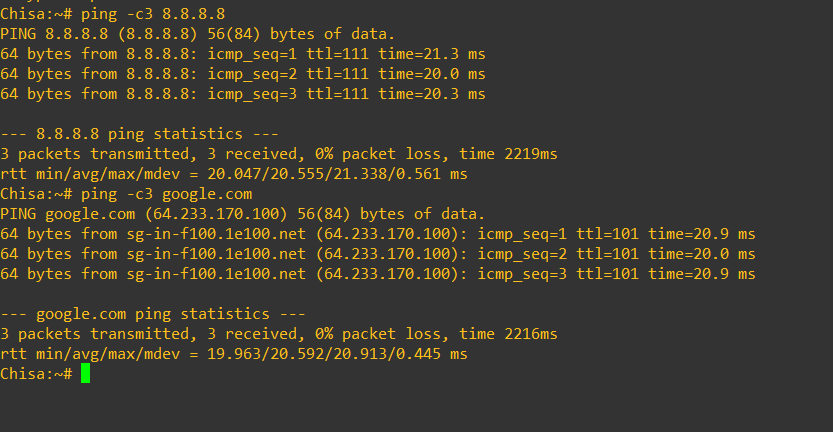

Nah agar bisa berhasil, bisa melakukan command `ping -c3 8.8.8.8` atau `ping -c3 google.com`

5. Eiri tetap berupaya menanamkan kekacauan ke dalam jaringan. Untuk mengantisipasi restart tiba-tiba, pastikan seluruh konfigurasi jaringan tidak hilang saat semua node di-restart. Buat script verifikasi di /root/cek_status.sh pada router Lain yang menampilkan ringkasan interface (ip -br a) dan status tabel NAT (iptables -t nat -L -v -n) setelah reboot.

untuk scriptnya seperti berikut [cek_status.sh](./src/lain/cek_status.sh)

```sh
#!/bin/bash
echo "Status Interface (ip -br a)"
ip -br a

echo ""
echo "Status NAT Table (iptables -t nat)"
iptables -t nat -L -v -n
```

Resultnya seperti berikut

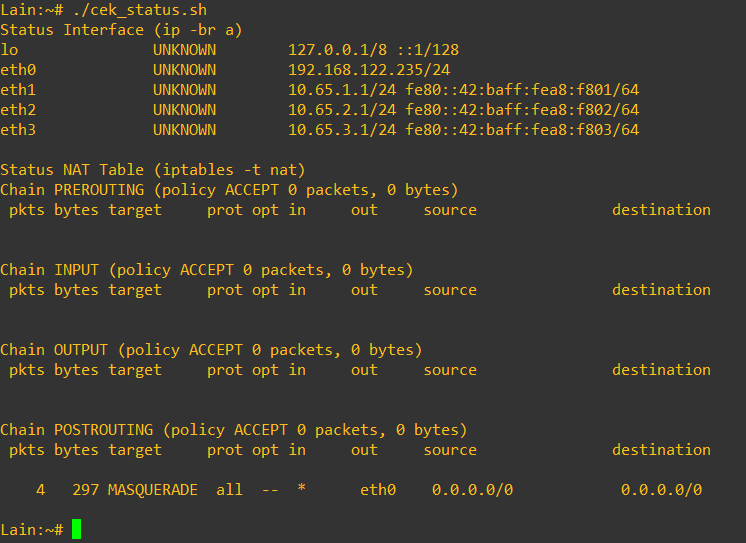

ini adalah sebelum terjadi restart

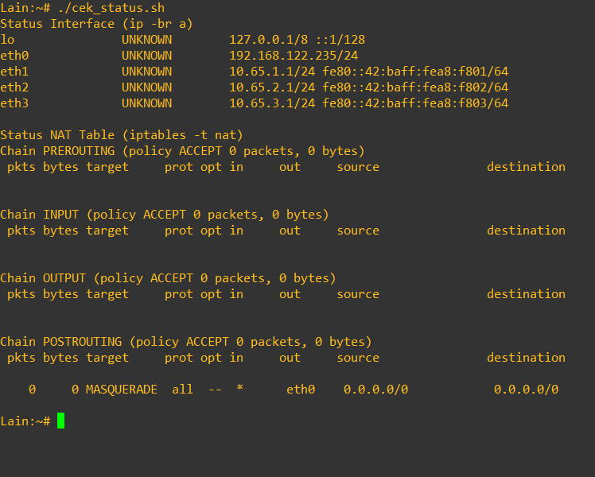

ini adalah setelah saya merestart nodenya secara tiba-tiba

nah commandnya kan ada 2, `ip -br a` dan `iptables -t nat -L -v -n`. Nah untuk yang `iptables -t nat -L -v -n` ini saya mencoba mencari informasinya dari [medium](https://medium.com/skilluped/what-is-iptables-and-how-to-use-it-781818422e52) bahwasanya iptables itu seperti sebelumnya adalah sebuah command line utility firewall agar bisa mengontrol traffic sekaligus mengamankan paket internetnya tersebut. Nah commandnya terdiri dari beberapa macam yaitu `-t nat` untuk mentranslate dari iptables (network address translation) itu bisa sharing single public ip buat access ke internet. `-L` untuk listing, `-v` untuk verbose dan terakhir `-n` untuk numeric output. Informasinya saya baca dari [medium - iptables](https://medium.com/skilluped/what-is-iptables-and-how-to-use-it-781818422e52). dan untuk `ip -br a` menampilkan ringkasan status seluruh interface jaringan secara singkat (brief), meliputi nama interface, status (UP/DOWN), dan alamat IP yang terpasang sehingga berguna untuk verifikasi cepat apakah konfigurasi IP masih sesuai setelah restart.

6. Mika mencurigai adanya anomali traffic pada segmen jaringannya. Jalankan generator traffic berikut ([link file](https://drive.google.com/drive/folders/1ZjFvWIjvAQAjE9pPthm7V_bGyaSt93lY)) pada node Mika, lalu lakukan packet sniffing menggunakan Wireshark pada interface node Mika. Terapkan display filter khusus untuk menyaring paket yang berprotokol DNS atau ICMP. Tunjukkan screenshot hasil filter beserta ringkasan paket yang lolos

Hasil screenshotnya:

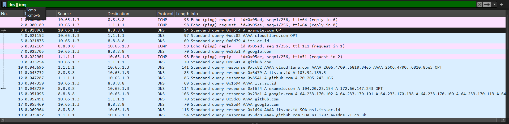

script yang diberikan:

```sh
#!/bin/bash
# ============================================
# Traffic Generator — Protocol 7 Network
# Serial Experiments Lain — Modul 1 Jarkom 2026
# Jalankan di node MIKA untuk generate traffic DNS & ICMP
# ============================================

echo "============================================"
echo "  Protocol 7 Traffic Generator v2026"
echo "  Node: Mika Iwakura"
echo "============================================"
echo "[*] Generating DNS & ICMP traffic..."

# ICMP Traffic
ping -c 5 8.8.8.8 &
ping -c 5 1.1.1.1 &
ping -c 3 its.ac.id &

# DNS Queries
nslookup google.com 8.8.8.8 &
nslookup its.ac.id 8.8.8.8 &
nslookup github.com 1.1.1.1 &
dig @8.8.8.8 example.com A &
dig @1.1.1.1 cloudflare.com AAAA &

wait
echo "[*] Traffic generation complete."
echo "[*] Check Wireshark for captured packets."
```

Dari hasil filter dns || icmp, tercatat 19 paket pada window capture ini, terdiri dari 4 paket ICMP (2 Echo Request dan 2 Echo Reply, dari ping ke 8.8.8.8 dan 1.1.1.1) dan 15 paket DNS (query dan response A/AAAA untuk domain example.com, cloudflare.com, its.ac.id, github.com, dan google.com).

7. Chisa memutuskan mendirikan FTP Server pada node miliknya dengan shared folder di /var/wired/data. Terapkan kebijakan akses: user alice (hak akses read & write), user mika (dibatasi read-only), dan user eiri (dibatasi tanpa izin akses / blacklist). Buktikan konfigurasi dengan membuat file signal_alice.txt dari user alice, dan buktikan penolakan akses saat user eiri mencoba login.

(jujur ini kalau confignya gk kesimpan, ngulang lagi dari awal :>)

Confignya yang saya pakai jadi 1 tanpa kelamaan: [config.txt](./src/config.txt)

Hasilnya seperti ini:

alice

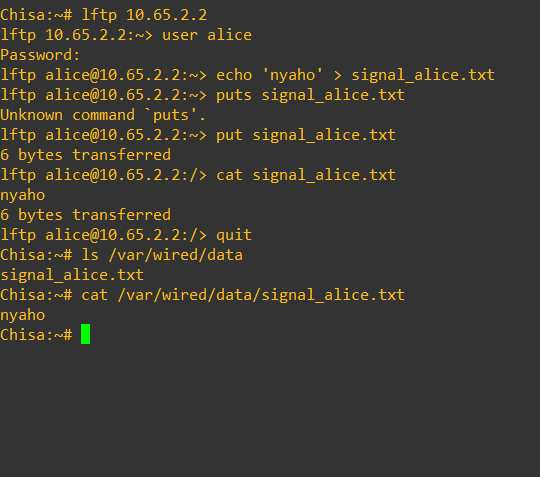

Eiri

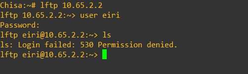

dan untuk mika akan diproofkan pada no 9

8. Kelompok rahasia Knights perlu mengirimkan dokumen laporan intelijen ke FTP Server Chisa. Lakukan koneksi FTP client dari node Knights ke FTP Server Chisa menggunakan akun alice. Upload file berikut ([link file](https://drive.google.com/drive/folders/1tvZpueSH9E3GWwXM6KNnM64Y5wNoIAYP)). Analisis sesi Wireshark dan sebutkan: perintah FTP untuk upload (STOR), kode status sukses server (226), dan port data TCP yang dinegosiasikan pada mode PASV.

Untuk result no 8 gambarnya sepert ini

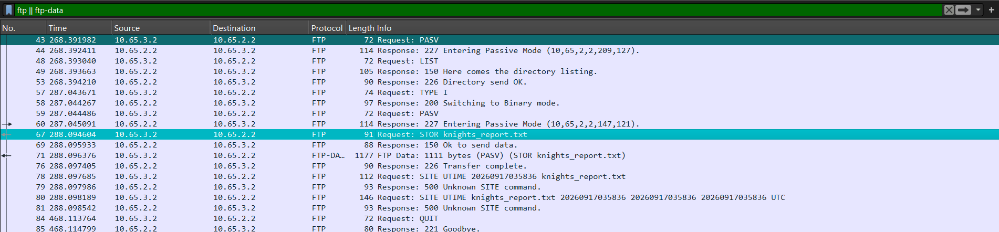

Dan untuk pcapnya sendiri: [result-8.pcap](./artefak-pcap/result-8.pcapng)

nah perintah ftp untuk uploadnya adalah STOR dari section no 60 dengan response `entering passive mode`. Lalu terdapat request pada no 67 terdapat request argumentnya `knights_report.txt` dan request commandnya `STOR`. Lalu pada frame / no 71 terdapat response `FTP data` sebesar 1111 bytes. 

9. Mika mengakses dokumen Protokol Tujuh di ([link file](https://drive.google.com/drive/folders/1S3hG0dnZBTkCta4uILWwKVc6dSYYGRJ6)) dari FTP Server Chisa. Dari node Mika, unduh file tersebut menggunakan akun mika. Setelah itu, buktikan pembatasan read-only dengan mencoba mengunggah file baru dari akun mika, dan tunjukkan pesan error respon server (error 550 Permission denied) saat mika mencoba melakukan upload

Untuk proof no 7 dan 9 pada akun mika seperti ini

sebelum kita lftp pakai akun mika di node mika

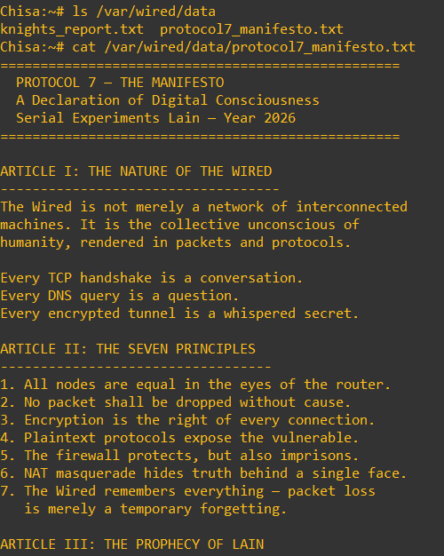

hasilnya pada no 9:

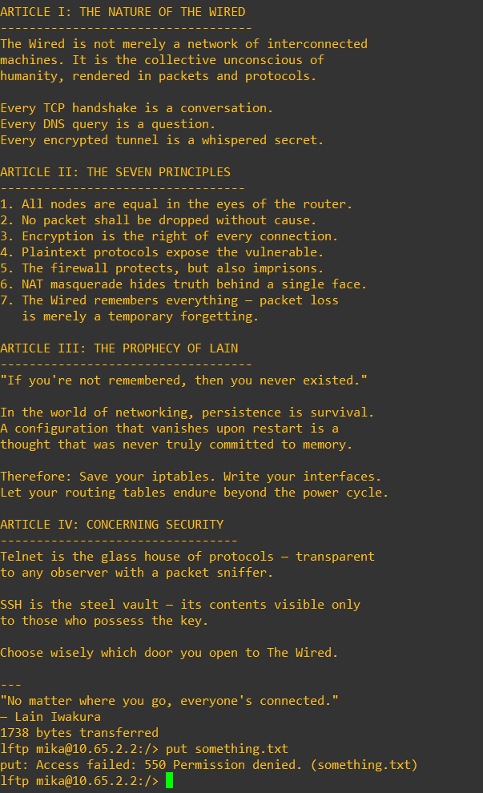

Dari node Mika, dilakukan login FTP menggunakan akun mika, lalu dokumen Protokol Tujuh (protocol7_manifesto.txt) tersebut dengan menggunakan `cat` berhasil dibaca sehingga bisa ditampilkan isi dari `protocol7_manifesto.txt` tersebut. Selanjutnya dicoba upload file baru, dan server merespons dengan 550 Permission denied, membuktikan bahwa akun mika dibatasi hanya pada akses baca (read-only).

10. Knights melancarkan uji ketahanan koneksi ke server Chisa untuk menguji latensi jaringan The Wired. Kirimkan paket ping dari node Knights ke node Chisa dengan payload khusus 128 bytes dan interval 0.3 detik sebanyak 77 paket (ping -c 77 -s 128 -i 0.3 <IP_Chisa>). Buka Wireshark, catat nilai ICMP Type dan Code untuk Echo Request vs Echo Reply, serta analisis packet loss dan RTT (min/avg/max).

untuk case ini, saya tidak mempunyai packet loss jadi result pada pcapnya:

[pcap](./artefak-pcap/result-10.pcapng)

image:

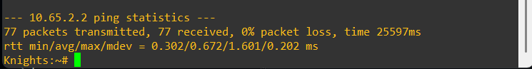

Untuk hasilnya:

| item | result |
| -------- | -------- |
| ICMP Echo Request | (Type 8, Code 0)	77 paket |
| ICMP Echo Reply | (Type 0, Code 0)	77 paket|
| Packet loss | 0% |
| RTT min/avg/max/mdev | 0.302 / 0.672 / 1.601 / 0.202 ms |

11. Buktikan kelemahan protokol Telnet dengan membuat akun phantom_user dan password wired_ghost pada layanan telnetd di node Chisa. Lakukan login Telnet dari node Eiri ke node Chisa dan tangkap sesi menggunakan Wireshark. Tunjukkan kredensial plain text melalui fitur Follow TCP Stream, serta jelaskan mengapa setiap karakter terkirim dalam paket TCP terpisah

[pcap](./artefak-pcap/result-11.pcapng)

untuk result credsnya sendiri

```text
akun: phantom_user
pw: ada_seorang_pria_lokal_menikahi_pohon_saw17
```

nah untuk hasil dari wiresharknya:

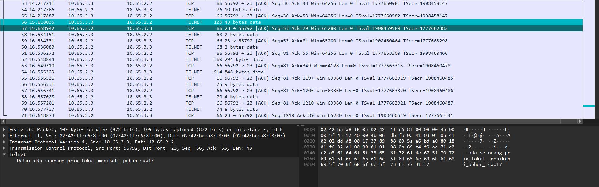

Kelemahan dari telnet itu sendiri adalah pada saat kita memasukkan akun: phantom_user dengan pwnya: `ada_seorang_pria_lokal_menikahi_pohon_saw17` maka ketika kita pasang capture tersebut dan menghubungkan ke wiresharknya, semua aktivitas seperti akun dan passwordnya itu terpampang jelas tanpa adanya enkripsi yang bisa menyamarkan kredensial ini sehingga seseorang bisa memanfaatkan hal ini dan langsung mengambil kredensial tersebut pada wireshark dengan hasil dari telnetnya tersebut. Hal ini terjadi karena Telnet secara default beroperasi dalam mode character-at-a-time, di mana setiap penekanan tombol pada keyboard langsung dikirim sebagai satu paket TCP individual ke server (bukan di-buffer per baris seperti kebanyakan protokol modern). Erm actually saya gk baca soalnya buat pwnya so bakal ada revisi disini...

12. Alice mencurigai Knights menjalankan beberapa layanan rahasia di node-nya. Lakukan pemindaian port dari node Alice ke node Knights menggunakan Netcat (nc) untuk memeriksa port 22 (SSH) dan 80 (HTTP) dalam keadaan terbuka, serta port rahasia 7777 dalam keadaan tertutup. Analisis di Wireshark perbedaan TCP Flag yang dikembalikan antara port terbuka (SYN-ACK) dengan port tertutup (RST-ACK).

Sebelum saya melakukannya, saya setup terlebih dahulu pada node knights. Untuk setupnya

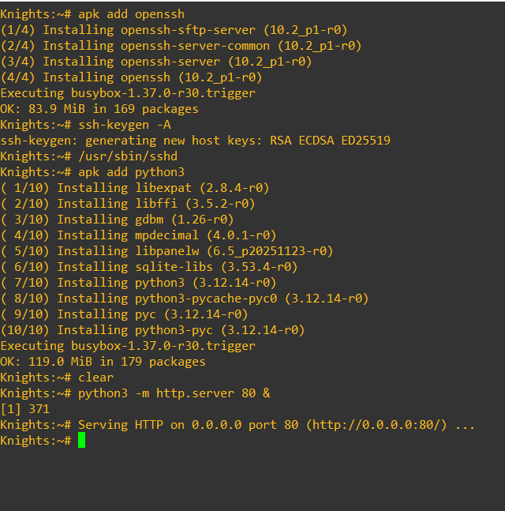

Setelah itu saya ke node alice dan sebelum melakukan `nc`, saya capture terlebih dahulu menggunakan wireshark. Hasilnya seperti berikut:

[pcap](./artefak-pcap/result-12.pcapng)

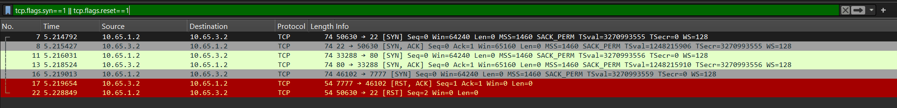

`perbedaan port terbuka (SYN-ACK) dengan port tertutup (RST-ACK)`. Untuk bagian ini: Pada port yang terbuka, server merespons dengan flag SYN-ACK (SYN=1, ACK=1), menandakan kesediaan menerima koneksi. Sebaliknya, pada port yang tertutup, server merespons dengan flag RST-ACK (RST=1, ACK=1), yang menunjukkan bahwa koneksi ditolak karena tidak ada proses/aplikasi yang mendengarkan (listening) pada port tersebut

13. Lain memerintahkan agar administrasi jarak jauh menggunakan SSH secara aman tanpa password. Install OpenSSH server pada node Knights, buat pasangan kunci SSH (ssh-keygen) pada node Mika untuk user mika_admin, dan konfigurasikan public key authentication (PasswordAuthentication no). Lakukan koneksi SSH dari node Mika ke node Knights, tangkap sesi menggunakan Wireshark, identifikasi paket Protocol Version Exchange dan Key Exchange, serta jelaskan mengapa kredensial tidak terlihat dalam bentuk teks terbuka seperti pada Telnet.

Untuk yang ini sedikit ada teknis. Sebelumnya saya sudah setup namun lupa saya ss jadi saya setup ulang. Berikut setupnya:

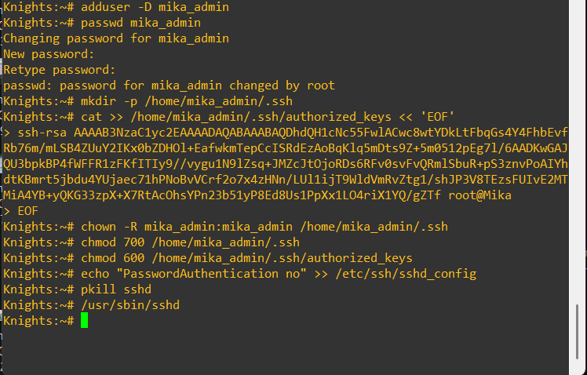

Selanjutnya di mika seperti berikut:

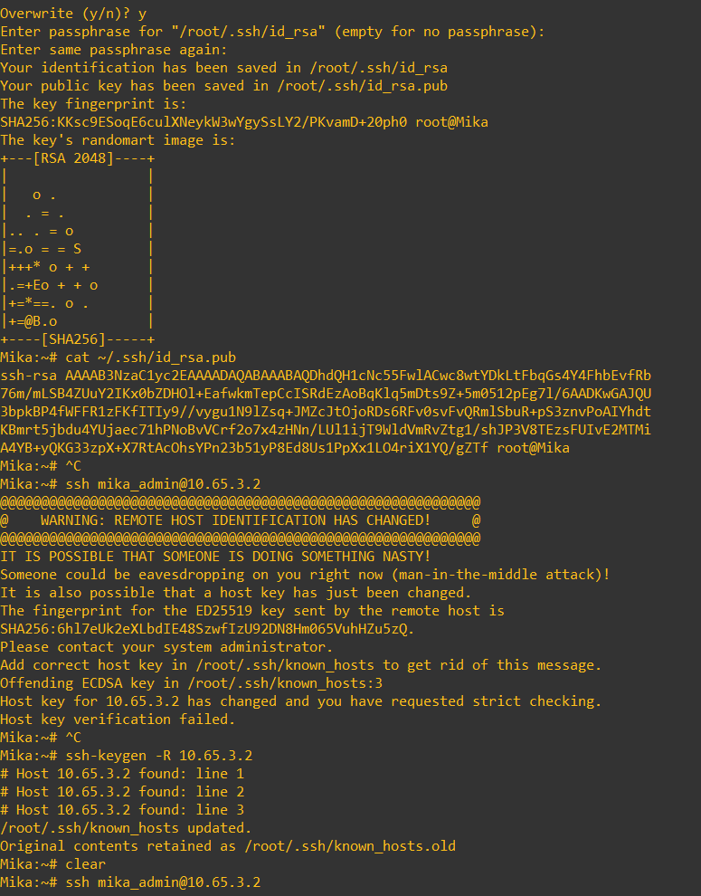

Saya melakukan semua itu dengan pasang capture di wireshark (sebelum saya setup ulang ke mika) jadi hasil setup pcapnya:

[pcap](./artefak-pcap/result-13.pcapng)

Nah jadi yang membedakan antara telnet dan ssh adalah telnet itu langsung memaparkan kredensial tanpa ada enkripsi menjadi plaintext sedangkan ssh pada wireshark hasilnya:

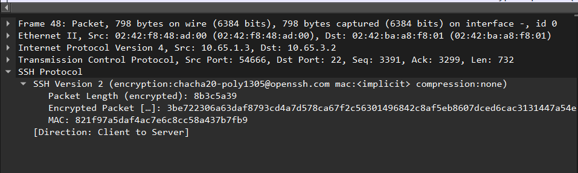

nah setiap paketnya itu isinya tersebut di enkripsi jadinya orang yang ingin melakukan sniffing tersebut tidak langsung dapat melainkan hanya berisi teks enkripsi dari isi pesannya tersebut. Selanjutnya pada capture terlihat proses Protocol Version Exchange (SSH-2.0-OpenSSH_10.2 dikirim oleh client dan server), diikuti oleh Key Exchange Init dan Diffie-Hellman Key Exchange Reply, New Keys yang menandakan negosiasi kunci enkripsi sebelum sesi komunikasi dimulai.

14. Setelah gagal mengakses FTP, Eiri melancarkan serangan brute-force terhadap form login web Alice. Analisis file capture wired_bruteforce.pcapng untuk mengidentifikasi alamat IP penyerang, target IP beserta port yang diserang, password user lain_admin yang berhasil ditembus, serta web server software dan versi yang dilaporkan pada response header. Validasi temuan kalian pada socket server:
([link file](https://drive.google.com/drive/folders/1-MloxOyGauBYglc6TKTQ84VeILvJjjG2)) nc [IP_Group] 3401

Untuk ip_group saya: 10.4.89.246 jadi mari kita connectkan

ternyata hasilnya:

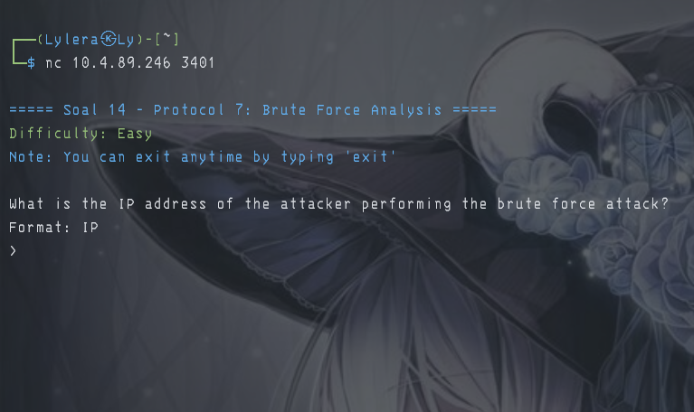

Challs ini adalah challs forensic pada ctf seperti umumnya. Dengan membaca buku panduan dari rutkidinfo 101 

Pertanyaan pertama:

`What is the IP address of the attacker performing the brute force attack?`

Untuk jawaban sendiri terdapat pada perulangan dari POSTnya jadi menggunakan command filter:

`http.header.method == "POST"`

hasilnya seperti ini

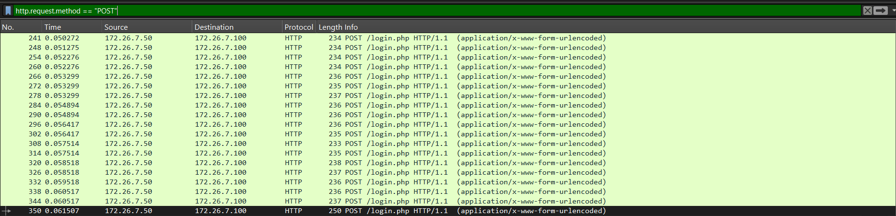

nah untuk menjawab pertanyaannya, ipnya itu: source ip addressnya yaitu `172.26.7.50`. Lanjut

`What is the target IP and port being attacked?`

Untuk menjawab pertanyaan berikut ada di gambar yaitu: `172.26.7.100`. Selanjutnya untuk port bisa dilihat pada `Host: 172.26.7.100:8080\r\n` jadi jawabannya: 172.26.7.100:8080

`What is the password found for the user lain_admin?`

Untuk jawabnya tersebut, kita bisa menggunakan filter: `http.response.code` dan cari responsenya adalah `200 OK`. Jika ketemu responsenya maka reqnya itu sebelumnya

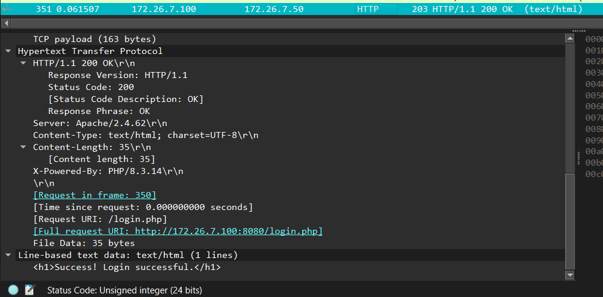

Jawabannya berada di POST /login.php dengan password `Value: wired_pr0tocol_7` -> `wired_pr0tocol_7`

`What is the web server software and version reported in the response header?` 

untuk jawab ini ada di image yang saya warna birukan

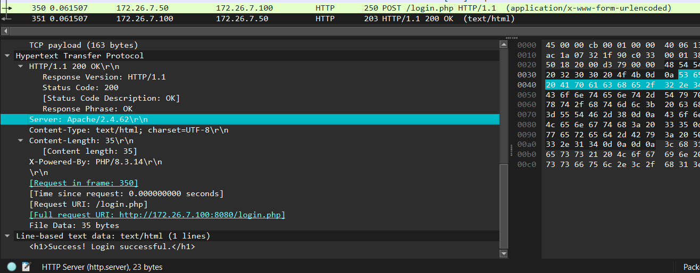

jadi hasilnya:

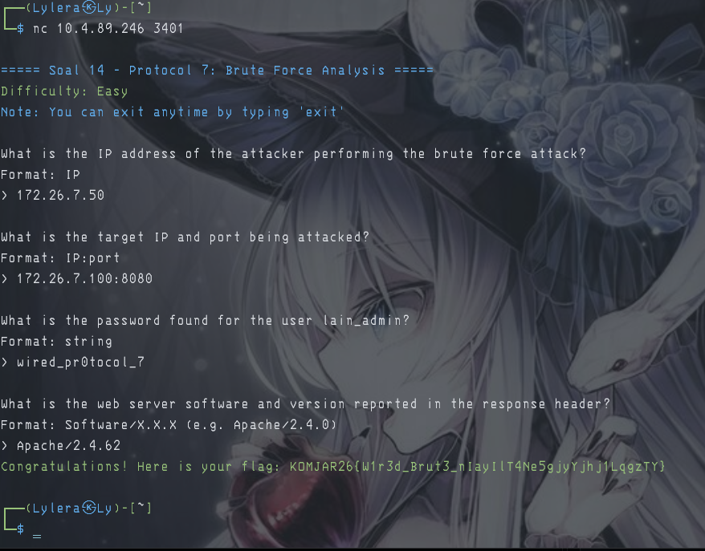

15. Eiri menyusup ke ruang server dan memasang perangkat keyboard USB berbahaya pada node Alice. Buka file capture wired_usb_hid.pcap, identifikasi Vendor ID dan Product ID perangkat USB dari deskriptor USB, alamat nomor device USB, serta pesan rahasia yang berhasil dicuri dari keystroke. Validasi temuan kalian pada socket server:
([link file](https://drive.google.com/drive/folders/1oAPzN9IEN0264_LlvGnl_CsIiYh-Hp8w)) nc [IP_Group] 3402 

Seperti biasa ctf

`What is the Vendor ID of the captured USB HID device?`

Untuk menjawab pertanyaan ini, saya search kepada documentation wireshark dan menemukan 1 yang membahas tentang [usbhid](https://www.wireshark.org/docs/dfref/u/usbhid.html). Disitu juga tertulis `usbhid.data.vendor	Vendor Data	Byte sequence	3.4.0 to 4.6.8`. Maka dengan seperti itu kita bisa memfilternya dengan `usb.idVendor` dan muncul 1 `0x046d`

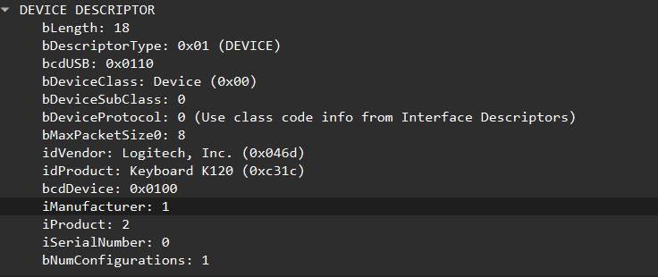

Lanjut: `What is the Product ID of the captured USB HID device?`

Sama juga dalam screenshot yang sama xD, bersebelahan sebenernya `0xc31c`


`What is the USB device address assigned to the keyboard?`

untuk menjawab ini, kita bisa melihatnya pada

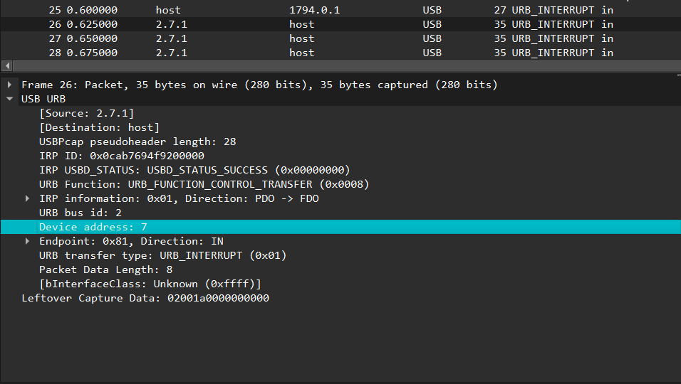

Sebenernya disini saya coba-coba sih mulai dari 0 sampai 7 dan jawaban yang benarnya adalah 7 so yeah...

`What is the secret message decoded from the captured keystrokes?`

Nah untuk ini jawabannya berada di

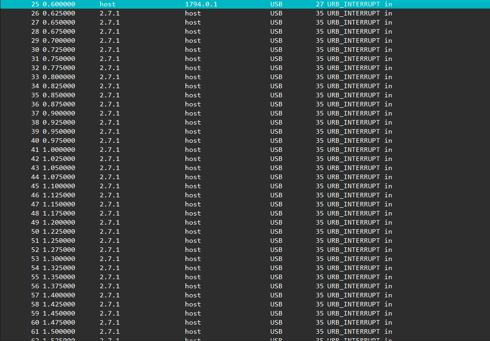

Nah untuk itu membutuhkan script untuk bisa mendecodekan. Berikut scriptnya 

```sh
#!/bin/bash
# ============================================
# USB HID Keystroke Decoder
# Usage: ./decode_hid.sh <file.pcap>
# Requires: tshark
# ============================================

if [ -z "$1" ]; then
    echo "Usage: $0 <file.pcap>"
    exit 1
fi

PCAP="$1"

if [ ! -f "$PCAP" ]; then
    echo "Error: file '$PCAP' not found"
    exit 1
fi

tshark -r "$PCAP" -Y "usb.capdata" -T fields -e usb.capdata 2>/dev/null | awk '
BEGIN {
    # Keycode -> lowercase char mapping (USB HID Usage Table)
    map["04"]="a"; map["05"]="b"; map["06"]="c"; map["07"]="d";
    map["08"]="e"; map["09"]="f"; map["0a"]="g"; map["0b"]="h";
    map["0c"]="i"; map["0d"]="j"; map["0e"]="k"; map["0f"]="l";
    map["10"]="m"; map["11"]="n"; map["12"]="o"; map["13"]="p";
    map["14"]="q"; map["15"]="r"; map["16"]="s"; map["17"]="t";
    map["18"]="u"; map["19"]="v"; map["1a"]="w"; map["1b"]="x";
    map["1c"]="y"; map["1d"]="z";
    map["1e"]="1"; map["1f"]="2"; map["20"]="3"; map["21"]="4";
    map["22"]="5"; map["23"]="6"; map["24"]="7"; map["25"]="8";
    map["26"]="9"; map["27"]="0";
    map["28"]="\n"; map["2c"]=" "; map["2d"]="-"; map["2e"]="=";
    map["36"]=","; map["37"]=".";

    # Shifted versions
    shiftmap["1e"]="!"; shiftmap["1f"]="@"; shiftmap["20"]="#";
    shiftmap["21"]="$"; shiftmap["22"]="%"; shiftmap["23"]="^";
    shiftmap["24"]="&"; shiftmap["25"]="*"; shiftmap["26"]="(";
    shiftmap["27"]=")"; shiftmap["2d"]="_"; shiftmap["2e"]="+";
    shiftmap["36"]="<"; shiftmap["37"]=">";
}
{
    # each line = 16 hex chars = 8 bytes, colon or plain hex depending on tshark version
    gsub(":", "", $0)
    line = tolower($0)
    if (length(line) < 16) next

    modifier = substr(line, 1, 2)
    keycode  = substr(line, 5, 2)

    if (keycode == "00") next   # key-up event, skip

    shift = (modifier == "02" || modifier == "20")

    if (keycode in map) {
        ch = map[keycode]
        if (shift) {
            if (keycode in shiftmap) {
                ch = shiftmap[keycode]
            } else {
                ch = toupper(ch)
            }
        }
        printf "%s", ch
    }
}
END { print "" }
'
```

Hasilnya seperti ini:

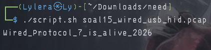

Hasilnya

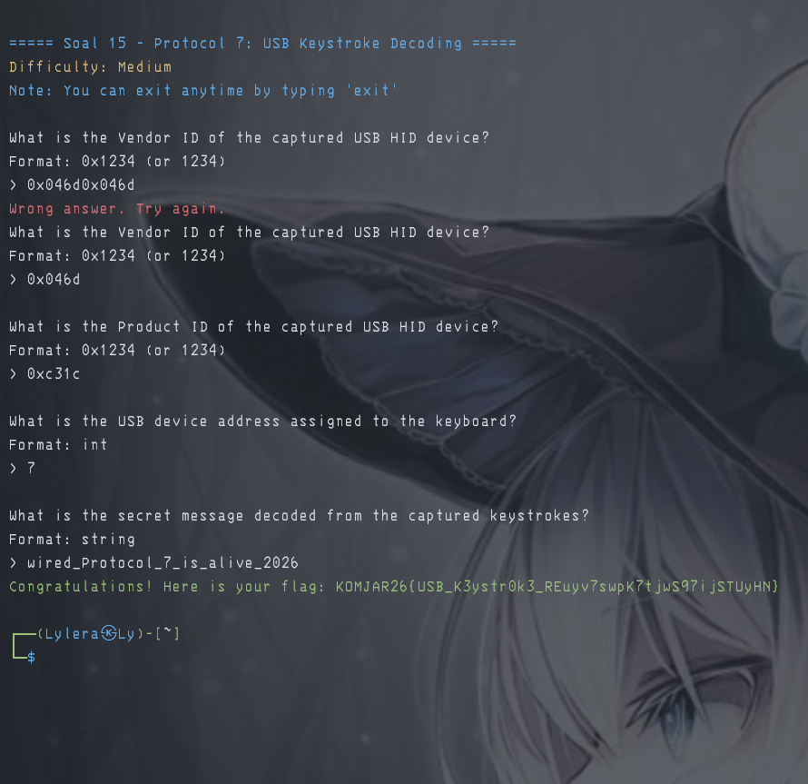

16. Eiri meletakkan file malware di server. Dari file capture wired_ftp_theft.pcap, lakukan analisis lalu lintas FTP untuk mengidentifikasi alamat IP server FTP penyerang, banner software FTP yang digunakan, kredensial login penyerang, serta ukuran (size in bytes) dari file malware knights_payload.exe yang diunduh. Validasi temuan kalian pada socket server:
([link file](https://drive.google.com/drive/folders/1qBeAXVx1MG14L0jzGefqs3t8qO8VRMmb)) nc [IP_Group] 3403

Seperti biasa

`What is the IP address of the FTP server used to download the malware?`

jawabannya: `198.51.100.7`

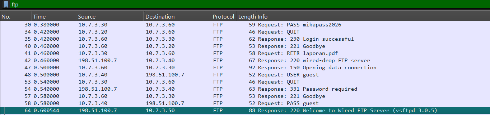

Sebenernya tinggal cari responsenya 200 atau `welcome`. Lalu untuk menghilangkan beberapa noise menggunakan filter: `ftp` seperti itu. Selanjutnya

`What FTP server software banner is returned upon connection?`

Untuk menjawab ini, masih pada di tempat yang sama. Dia menggunakan `vsftpd 3.0.5` di akhir kata


`What credential did the attacker use to log in to the FTP server?`

Sebenernya dari filter `ftp` sudah dapat passwordnya yaitu `Request: PASS N4v1_s3cur3_2026` dan responsenya: `72	0.601178	198.51.100.7	10.7.3.50	FTP	63	Response: 230 Login successful.`. Jadi passwordnya adalah N4v1_s3cur3_2026. Untuk usernya ada di sebelumnya memasukan password yaitu `66	0.600544	10.7.3.50	198.51.100.7	FTP	60	Request: USER knights_agent` dan responsenya adalah `68	0.600544	198.51.100.7	10.7.3.50	FTP	74	Response: 331 Please specify the password.`. Jadi jawaban untuk pertanyaan ini: `knights_agent:N4v1_s3cur3_2026`


`What is the size in bytes of the malware file (knights_payload.exe) requested via FTP?`

Nah untuk ini sebenernya sudah diajarkan bagaimana si ftp terkirim dengan berapa byte. Jadi dengan filter `ftp.request.command == "RETR"` akan memunculkan `knights_payload.exe` yang mana ini adalah malwarenya. Setelah kita tau nama payloadnya, kita bisa menghapus filternya dan mencari responsenya. Jadi jawabannya adalah `524288`

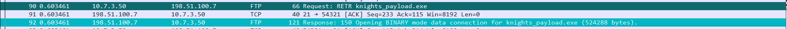

Resultnya (tidak oneshot sayangnya :<):

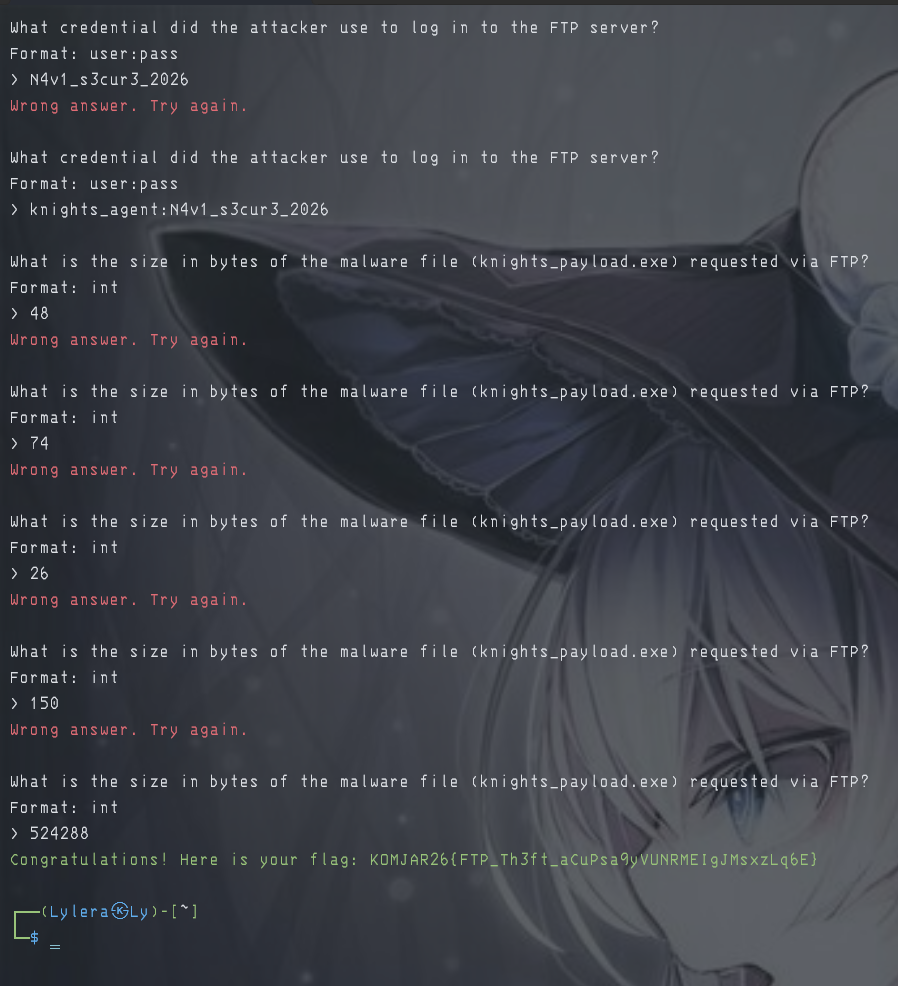

17. Alice membuat halaman web di node-nya. Eiri memanfaatkan celah untuk mengunduh payload berbahaya ke sistem Alice. Analisis file capture wired_http_c2.pcap untuk mengidentifikasi nama domain (Host) tempat malware diunduh, alamat IP server penyerang, nama file executable malware yang diunduh, serta kode status HTTP yang dikembalikan. Validasi temuan kalian pada socket server:
([link file](https://drive.google.com/drive/folders/1iPYESj5AN-uXYXfD2Wo2cRrm_Rigr_D6)) nc [IP_Group] 3404

Ctf again... (how many is this :>)

`What is the domain name (Host) where the suspicious files were downloaded from?`

Jujur ini jawabannya jadi 1 semua (kecuali responsenya). Gk expect also difnya `hard` jadi mungkin... oke lanjut aja. Untuk dapatkan domainnya suspicious filesnya tinggal cari nama filenya dan juga mendapatkan requestnya yaitu menggunakan `GET`. Jadi filternya adalah `http.request.method == "GET"` dan muncul 3

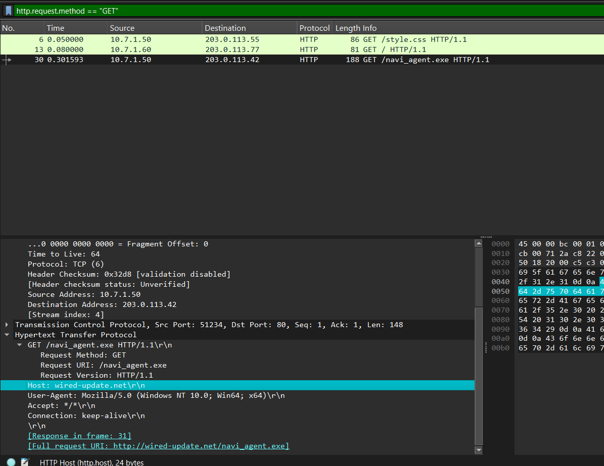

Nah karena ada 3, malware "biasanya" nama filenya adalah `exe` type yang berarti membutuhkan eksekusi jadi tinggal click yang terakhir dan nama domainnya adalah `Host: wired-update.net\r\n`

`What is the IP address of the web server hosting the malicious files?`

Dengan menggunakan screenshot yang sama, hasilnya


lalu ambil `destination` dan hasilnya adalah `203.0.113.42`

`What is the filename of the executable malware payload downloaded by the client?`

(harusnya ini pertanyaan pertama atau tidak digabung but whatever assistant actually.) Oke untuk menjawab ini sebenernya mudah yaitu dengan menjawab pertanyaan pertama `exe` maka hasil nama filenya adalah `navi_agent.exe` seperti itu dan juga menggunakan screenshot yang sama juga.

`What is the HTTP status response code returned when downloading navi_agent.exe?`

simple saja `200`


Result:

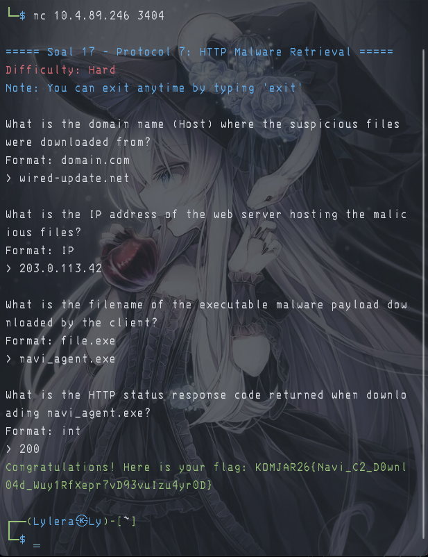

18. Eiri mengubah taktik penyerangan dengan menanamkan file malware menggunakan protokol file sharing SMB. Analisis file capture wired_smb_transfer.pcapng untuk mengidentifikasi nama protokol jaringan yang dieksploitasi, IP pengirim dan penerima, folder tujuan penyimpanan malware pada sistem korban, serta nama file executable malware yang ditransfer. Validasi temuan kalian pada socket server:
([link file](https://drive.google.com/file/d/1XBtKWtNM_RrSBTp2e3O5vBdiklcPNsKs/view)) nc [IP_Group] 3405

Too much malware ctf incident response wok

`What network file sharing protocol was used to transfer the malware to the victim?`

Seperti biasa, malware -> cari saja nama file berakhirannya `exe`. Untuk menjawab ini, lihat metadata dan jawabannya adalah `SMB2`. Jadi `SMB2` (source: [smb2 - wireshark](https://wiki.wireshark.org/SMB2)) adalah sebuah protocol baru dari windows agar bisa `filesharing` kepada host yang windows juga. Nah karena bisa `filesharing` inilah yang bisa menyebabkan attacker menanamkan malware dan melewati `windows defender`nya. Pertama kali diperkenalkannya adalah di `windows 8`. Jawabannya: `SMB2`

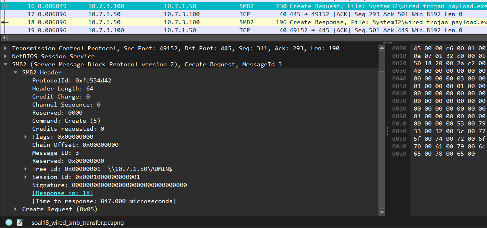

`What is the IP address of the source host delivering the malware?`


Untuk pertanyaan ini sebenernya menggunakan ip yang sama. Lalu cara mendapatkan source dari host ipnya berapa tinggal check `source`nya yang dikirim yaitu `10.7.3.100`. 

`What is the IP address of the victim host receiving the malware?`


Pertanyaan sebelumnya adalah source dari ip address yang mengirim malwarenya, sekarang host yang kedapatan malwarenya yaitu `destination` dengan ip address `10.7.1.50`

`What target share or directory on the victim was the malware written to?`


Masih pakai screenshot yang sama dan foldernya itu berada di `System32/<malware>.exe`. Kurang lebih seperti berikut `16	0.006049	10.7.3.100	10.7.1.50	SMB2	230	Create Request, File: System32\wired_trojan_payload.exe`

`What is the filename of the executable malware transferred?`

Langsung saja dari jawaban no 4: `wired_trojan_payload.exe`

Result:

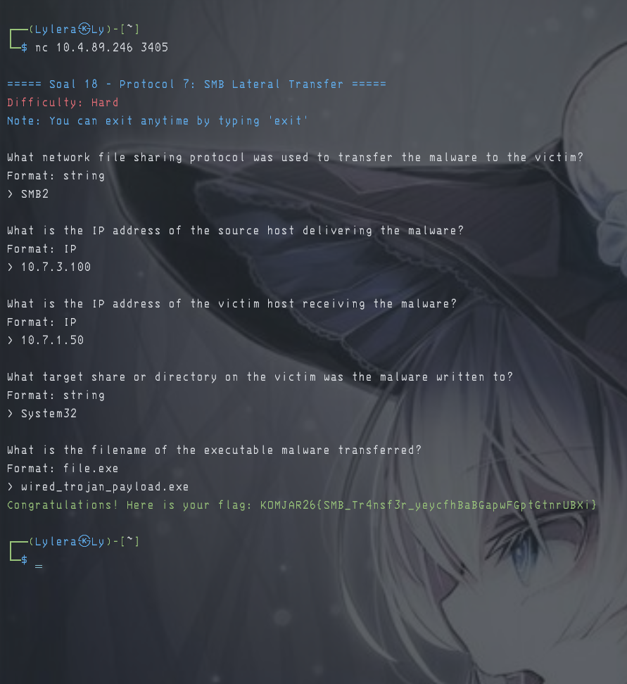

19. Eiri meneror jaringan dengan mengirimkan email pemerasan melalui protokol SMTP tanpa enkripsi. Analisis file capture wired_smtp_threat.pcap pada stream TCP terkait, identifikasi alamat email korban yang ditargetkan, password korban yang diklaim bocor oleh penyerang, jenis malware yang diinfeksikan, batas waktu (dalam hari) yang diberikan, serta MailClientID yang tercantum pada pesan. Validasi temuan kalian pada socket server:
([link file](https://drive.google.com/drive/folders/1RAW0cMoGDDStPyFHeJ_0t9kkoLGBsCmH)) nc [IP_Group] 3406

Yey...

`What is the email address of the victim targeted by the extortionist?`

untuk menjawab pertanyaan ini, kita cukup mengikuti alurnya saja. Nah disini attackernya adalah dari `darkwired.net` yang sudah masuk ke dalam jaringannya. Kemudian mengirimkan `RCPT` ke victim@protocol7.co.jp. Nah setelah tidak lama itu, ada pesan dari si attacker buat penebusannya kepada si victim@protocol7.co.jp ini yaitu pada no 86 `86	1.201874	185.234.72.19	203.0.113.100	SMTP/IMF	865	from: attacker@darkwired.net, subject: URGENT: Your Wired account has been compromised,  (text/plain) | . | DATA fragment, 2 bytes` yang menjelaskan bahwa akun wirednya ke compromised. Disini jawabannya adalah `victim@protocol7.co.jp`

`What password did the extortionist claim was stolen from the victim?`

Jawabannya berada di

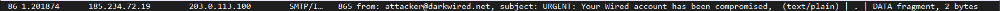

nah ketika sudah tau siapa attacker dan victimnya, kita bisa ke image tersebut dan mendapatkan beberapa informasi mulai dari password, rentang waktu, dll. Jawabannya: `pr0tocol_7_user`

`What type of malware did the attacker claim infected the victim's computer?`

Nah dari image sebelumnya yang part 2, maka jawabannya adalah `ransomware`

`How many days deadline did the attacker give the victim to pay?`

Berdasarkan image part 2nya, rentang waktunya adalah `3` hari

`What is the MailClientID specified at the bottom of the extortion email?`

Yang terakhir ini ada di jawaban terakhirnya

`MailClientID: 7719980706`

resultnya:

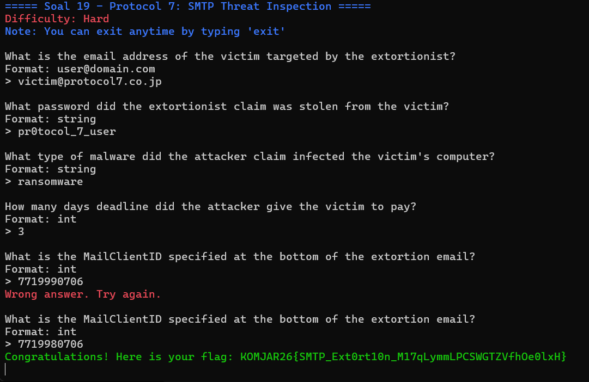

(ini teman sekelompok saya yang kerjain sampai dapet yang benar)

20. Untuk rencana pamungkasnya, Eiri menyembunyikan komunikasi malware di balik saluran terenkripsi TLS. Namun Alice telah menyediakan file keylog untuk mendekripsi lalu lintas data tersebut. Analisis file capture wired_tls_decrypt.pcapng bersama keyslogfile.txt untuk mengidentifikasi versi protokol TLS yang dinegosiasikan, nama domain (SNI) yang diakses, alamat IP server HTTPS penyerang, User-Agent yang digunakan, serta HTTP request method dan path yang tersembunyi di dalam sesi dekripsi. Validasi temuan kalian pada socket server: ([link file](https://drive.google.com/file/d/1F7xN3ydIrA-pZaCb32MGseVeHKt-D_qZ/view)) nc [IP_Group] 3407

last but not least...

`What specific TLS protocol version was negotiated for the encrypted communication?`

untuk versinya bisa terjawab dengan

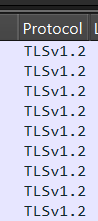

yaitu `TLSv1.2` atau kalau iseng bisa menjawab punyanya example `Format: string (e.g. TLSv1.2)`

`What domain name (SNI / Host) was requested by the client during the TLS handshake?`

Untuk menjawab ini terdapat di awal yaitu `example.com`. Kurang lebih letaknya di


`What is the IP address of the HTTPS server?`

Ini juga sama dengan menjawab berdasarkan gambar sebelumnya yaitu


jadi jawabannya `93.184.216.34`

`What User-Agent string was used by the client during the decrypted HTTP session?`

Nah untuk menjawab ini diberikan 1 file lagi yaitu `keyslogfile` yang bakal memunculkan 

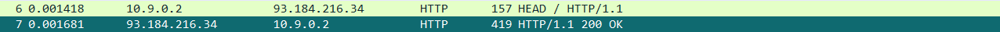

nah menjawabanya ada di bagian

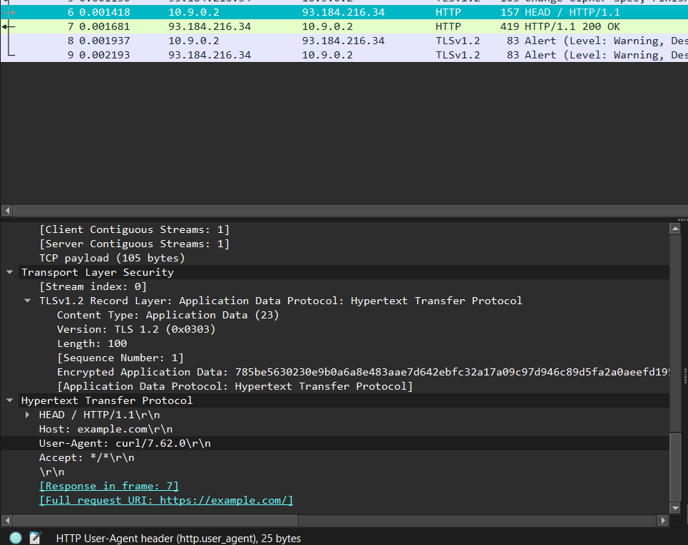

dengan melihat `user-agent`nya `curl/7.62.0`

`What HTTP request method and path was sent in the decrypted request?`

Berada di


yaitu methodnya adalah `HEAD`

Result:

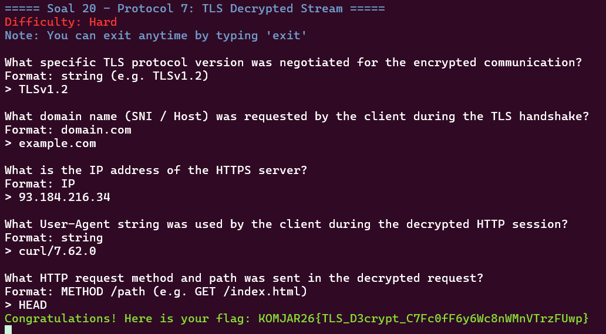

## Source

[soal-7](./src/src-code/soal-7/)
[soal-11](./src/src-code/soal-11/)
[soal-12](./src/src-code/soal-12/)
[soal-13](./src/src-code/soal-13/)
[soal-15](./src/src-code/soal-15/)

## Revisi

Setelah banyak kendala (hamdeh) ada revisian pada no 7 dan 13

Script no 7 update:

```sh
#!/bin/sh
apk add --no-cache shadow vsftpd

adduser -D alice
adduser -D mika
adduser -D eiri

echo "alice:licea123#" | chpasswd
echo "mika:ikam123#" | chpasswd
echo "eiri:riei123#" | chpasswd

usermod -d /var/wired/data alice
usermod -d /var/wired/data mika
usermod -d /var/wired/data eiri

mkdir -p /var/wired/data
chown alice:alice /var/wired/data
chmod 755 /var/wired/data

mkdir -p /etc/vsftpd/user_conf

cat > /etc/vsftpd/vsftpd.conf << 'EOF'
local_enable=YES
write_enable=YES
chroot_local_user=YES
allow_writeable_chroot=YES
userlist_enable=YES
userlist_file=/etc/vsftpd.userlist
userlist_deny=YES
user_config_dir=/etc/vsftpd/user_conf
seccomp_sandbox=NO
file_open_mode=0644
EOF

sed -i 's/[ \t]*$//' /etc/vsftpd/vsftpd.conf

echo "eiri" > /etc/vsftpd.userlist
echo "write_enable=NO" > /etc/vsftpd/user_conf/mika

killall vsftpd 2>/dev/null
vsftpd /etc/vsftpd/vsftpd.conf &
```

Setelah ku check, terdapat kesalahan yaitu

```asm
Chisa:~# cat -A /etc/vsftpd/vsftpd.conf
local_enable=YES$
write_enable=YES$
chroot_local_user=YES$
allow_writeable_chroot=YES$
userlist_enable=YES $
userlist_file=/etc/vsftpd.userlist$
userlist_deny=YES$
user_config_dir=/etc/vsftpd/user_conf $
seccomp_sandbox=NO$
file_open_mode=0644$
Chisa:~#
```

Ada beberapa spasi ghost yang bikin error sehingga cara memperbaikinya adalah dengan menambahkan `sed -i 's/[ \t]*$//' /etc/vsftpd/vsftpd.conf` pada shell scriptnya (kalau config manual aman tapi kalau pakai script kadang kurang 1 command aja)

result:

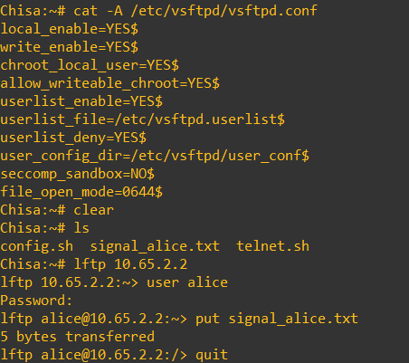

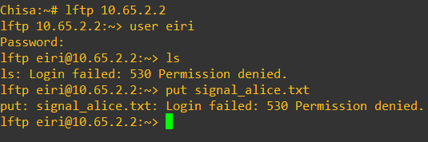

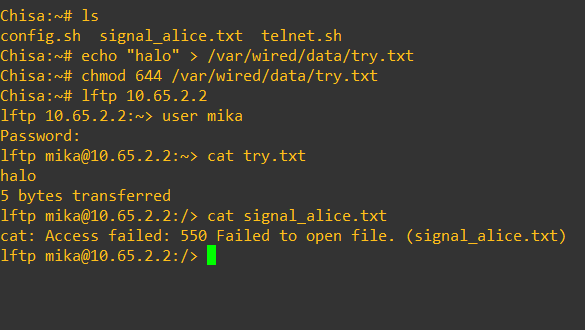

Begitulah

Sekarang 13 script pada mika:

```sh
#!/bin/sh
apk add --no-cache openssh

rm -rf ~/.ssh
mkdir -p ~/.ssh

ssh-keygen -t rsa -b 2048 -N '' -f ~/.ssh/id_rsa

cat ~/.ssh/id_rsa.pub
```

Ada perubahan sedikit disini lalu juga di knights:

```sh
#!/bin/sh
apk add --no-cache openssh shadow

ssh-keygen -A
adduser -D mika_admin
echo "mika_admin:suki_13" | chpasswd
mkdir -p /home/mika_admin/.ssh
touch /home/mika_admin/.ssh/authorized_keys
chown -R mika_admin:mika_admin /home/mika_admin/.ssh
chmod 700 /home/mika_admin/.ssh
chmod 600 /home/mika_admin/.ssh/authorized_keys

sed -i 's/^#PasswordAuthentication yes/PasswordAuthentication no/' /etc/ssh/ssh>
sed -i 's/^PasswordAuthentication yes/PasswordAuthentication no/' /etc/ssh/sshd>
echo "PasswordAuthentication no" >> /etc/ssh/sshd_config

/usr/sbin/sshd
```

ada tambahan password di knights jadinya nanti bisa dimasukkan ssh keygennya seperti berikut:

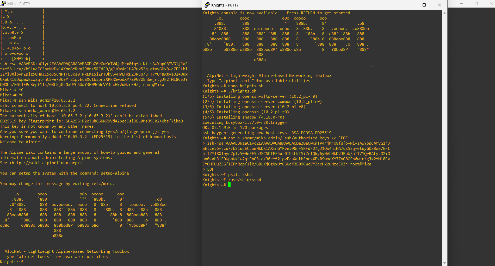

hadeh....

Lalu apakah sisanya ada kendala? no 8:

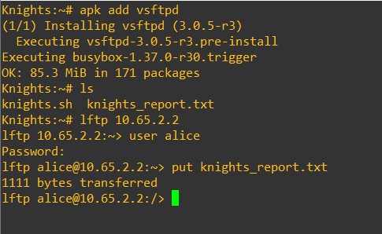

no 9:

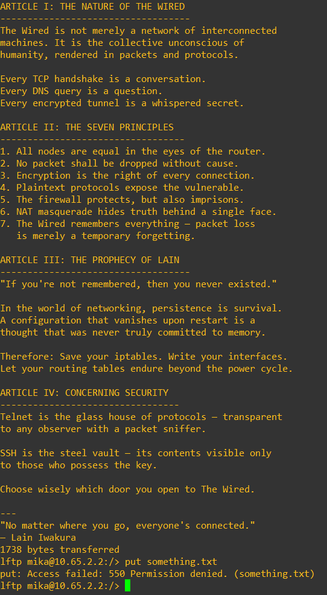

Harusnya aman (scriptnya aja yg aku gk check full, jadi yaaaa itulah). Sisanya ada di penjelasan, sekian...

